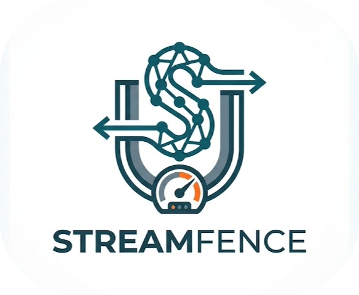

# StreamFence — Embeddable Java Socket.IO Server Library

<p align="center">
  
</p>

<p align="center">
  <a href="https://github.com/MoshPe/StreamFence/actions/workflows/ci.yml"></a>
  <a href="https://github.com/MoshPe/StreamFence/actions/workflows/codeql.yml"></a>
  <a href="https://codecov.io/gh/MoshPe/StreamFence"></a>
  <a href="https://central.sonatype.com/artifact/io.github.moshpe/streamfence-core"></a>
  <a href="https://github.com/MoshPe/StreamFence/releases/latest"></a>
  <a href="https://openjdk.org/projects/jdk/25/"></a>
  <a href="https://www.apache.org/licenses/LICENSE-2.0"></a>
</p>

Embeddable Java Socket.IO server with per-client backpressure, delivery guarantees, spill-to-disk overflow, Prometheus metrics, and YAML-driven configuration.

---

## Table of contents

- [What it is](#what-it-is)
- [When to use one server vs two](#when-to-use-one-server-vs-two)
- [Install](#install)
- [Quick start](#quick-start)
- [Client-side protocol](#client-side-protocol)
- [Config file loading](#config-file-loading)
- [Delivery modes](#delivery-modes)
- [Overflow policies](#overflow-policies)
- [Spill to disk](#spill-to-disk)
- [Authentication](#authentication)
- [TLS](#tls)
- [Metrics and management](#metrics-and-management)
- [Event listeners](#event-listeners)
- [Server API reference](#server-api-reference)
- [NamespaceSpec builder](#namespacespec-builder)
- [API reference](#api-reference)
- [Examples](#examples)
- [Demo](#demo)
- [Building](#building)
- [Status / roadmap](#status--roadmap)
- [License](#license)

---

## What it is

StreamFence is an embeddable Java library that wraps [netty-socketio](https://github.com/mrniko/netty-socketio) with production-grade delivery control. You get:

- **Per-client bounded queues** — every client/topic lane has hard message-count and byte-count limits, so a slow client cannot grow a queue without bound and threaten the JVM heap.
- **Five overflow policies** — choose what to do when a client cannot keep up: reject new messages, drop the oldest, coalesce to the newest, keep only the latest snapshot, or spill excess entries to disk and replay them later.
- **Two delivery modes** — `BEST_EFFORT` for low-overhead live feeds; `AT_LEAST_ONCE` for business-critical delivery with automatic retry, per-message acknowledgement tracking, and a pipelined in-flight window.
- **Spill-to-disk overflow** — when a client falls behind but you cannot afford to lose messages, `SPILL_TO_DISK` writes overflow entries atomically to disk, replays them in FIFO order when the in-memory queue drains, and cleans up on disconnect.
- **Prometheus metrics** — all counters (connections, publishes, overflow, retries, drops, spills) are scraped over a dedicated management HTTP port.
- **YAML / JSON configuration** — load a `SocketIoServerSpec` from a file and override any field via the fluent builder before `buildServer()`.

The project is a two-module Maven build:

- `streamfence-core` — the library. Public API lives in `io.streamfence`; internals live under `io.streamfence.internal.*` and are not stable API.
- `streamfence-demo` — a runnable multi-process showcase with a browser dashboard.

---

## When to use one server vs two

| Use case | Recommendation |
|----------|----------------|
| All topics share the same auth and transport config | One server, multiple namespaces |
| Feed topics (BEST_EFFORT) and control topics (AT_LEAST_ONCE) need independent ports or scaling | Two servers on separate ports |
| TLS and plaintext traffic on the same node | Two servers — one WSS, one WS |
| Complete isolation of scrape endpoint per workload | Two servers, each with its own `managementPort` |

See [MixedWorkloadExample](streamfence-demo/src/main/java/io/streamfence/demo/examples/MixedWorkloadExample.java) for a runnable two-server setup.

---

## Install

Add `streamfence-core` to your Maven project:

```xml
<dependency>
    <groupId>io.github.moshpe</groupId>
    <artifactId>streamfence-core</artifactId>
    <version>1.0.1</version>
</dependency>
```

Requires Java 25.

---

## Quick start

```java
import io.streamfence.*;
import java.util.Map;

try (SocketIoServer server = SocketIoServer.builder()
        .host("127.0.0.1")
        .port(9092)
        .namespace(NamespaceSpec.builder("/feed")
                .topic("prices")
                .deliveryMode(DeliveryMode.BEST_EFFORT)
                .overflowAction(OverflowAction.DROP_OLDEST)
                .maxQueuedMessagesPerClient(64)
                .maxQueuedBytesPerClient(524_288)
                .ackTimeoutMs(1_000)
                .maxRetries(0)
                .build())
        .managementPort(9093)
        .buildServer()) {

    server.start();

    // Broadcast to all subscribers
    server.publish("/feed", "prices", Map.of("bid", 100.0, "ask", 100.05));

    // Send to one specific client
    server.publishTo("/feed", "client-session-id", "prices", Map.of("bid", 99.5, "ask", 99.9));
}
```

---

## Client-side protocol

Connect to a namespace with the standard Socket.IO client, then use these events:

### Subscribe

```js
socket.emit("subscribe", { topic: "prices" });
socket.on("subscribed", msg => console.log("subscribed", msg));
```

### Receive messages

```js
socket.on("topic-message", envelope => {
    const { metadata, payload } = envelope;
    console.log(metadata.topic, payload);
});
```

### Acknowledge (AT_LEAST_ONCE only)

```js
socket.on("topic-message", envelope => {
    const { metadata, payload } = envelope;
    if (metadata.ackRequired) {
        socket.emit("ack", { topic: metadata.topic, messageId: metadata.messageId });
    }
});
```

### Unsubscribe

```js
socket.emit("unsubscribe", { topic: "prices" });
socket.on("unsubscribed", msg => console.log("unsubscribed", msg));
```

Error responses:

```js
socket.on("error", ({ code, message }) => console.error(code, message));
// Codes: AUTH_REJECTED, UNKNOWN_TOPIC, TRANSPORT_REJECTED
```

---

## Config file loading

```java
// From filesystem
SocketIoServerSpec spec = SocketIoServerSpec.fromYaml(Path.of("config/application.yaml"));

// From classpath resource
SocketIoServerSpec spec = SocketIoServerSpec.fromClasspath("application.yaml");

// Seed builder from file, then override individual fields
try (SocketIoServer server = SocketIoServer.builder()
        .fromYaml(Path.of("config/application.yaml"))
        .port(9192)          // override loaded port
        .listener(myListener)
        .buildServer()) {
    server.start();
}
```

Parse failures are wrapped in `IllegalArgumentException` and include the source path and — when Jackson provides it — the offending line number.

### YAML schema

```yaml
host: 0.0.0.0
port: 9092
transportMode: WS          # WS or WSS
managementHost: 0.0.0.0
managementPort: 9093       # 0 = disabled
shutdownDrainMs: 10000
senderThreads: 0           # 0 = auto (max(4, availableProcessors))
pingIntervalMs: 20000
pingTimeoutMs: 40000
maxFramePayloadLength: 5242880
maxHttpContentLength: 5242880
compressionEnabled: true
authMode: NONE             # NONE or TOKEN
staticTokens:
  my-client: secret-token
spillRootPath: .streamfence-spill   # root dir for SPILL_TO_DISK lanes
# tls:                     # required when transportMode: WSS
#   certChainPemPath: /certs/cert.pem
#   privateKeyPemPath: /certs/key.pem
#   privateKeyPassword:
#   keyStorePassword: changeit
#   protocol: TLSv1.3
namespaces:
  /feed:
    authRequired: false
topicPolicies:
  - namespace: /feed
    topics: [prices, quotes]
    deliveryMode: BEST_EFFORT
    overflowAction: DROP_OLDEST
    maxQueuedMessagesPerClient: 64
    maxQueuedBytesPerClient: 524288
    ackTimeoutMs: 1000
    maxRetries: 0
    coalesce: false
    allowPolling: true
    authRequired: false
    maxInFlight: 1
```

---

## Delivery modes

| Mode | Behavior | Use when |
|------|----------|----------|
| `BEST_EFFORT` | No ack tracking. Messages may be dropped or coalesced per overflow policy. Low overhead. | Live feeds, tickers, presence updates |
| `AT_LEAST_ONCE` | Each message carries a `messageId`. Server retries until the client sends `ack` or retry budget is exhausted. | Order events, alerts, durable command delivery |

`AT_LEAST_ONCE` constraints:

- `overflowAction` must be `REJECT_NEW`
- `coalesce` must be `false`
- `maxRetries` must be positive
- `maxInFlight` cannot exceed `maxQueuedMessagesPerClient`

---

## Overflow policies

| Policy | When full... | Best for |
|--------|-------------|----------|
| `REJECT_NEW` | Incoming message is dropped; overflow counter incremented | `AT_LEAST_ONCE`; any topic where queue order must be preserved |
| `DROP_OLDEST` | Oldest queued message is removed to admit the new one | Fast-moving feeds where freshness beats completeness |
| `COALESCE` | New message replaces an existing queued message with the same coalesce key | State feeds (tickers, presence) where only latest value matters |
| `SNAPSHOT_ONLY` | Queue is replaced with just the latest message | Portfolio snapshots, single-value feeds |
| `SPILL_TO_DISK` | Excess messages are written atomically to disk and replayed later | Burst absorption where no message may be lost but memory is bounded |

---

## Spill to disk

`SPILL_TO_DISK` extends the in-memory queue with a file-backed overflow tier:

1. When the in-memory queue (`maxQueuedMessagesPerClient`) is full, new messages are written as atomic temp-then-rename files under `spillRootPath/{namespace}/{topic}/`.
2. When the in-memory queue drains below capacity, spilled entries are loaded back from disk in FIFO order and queued for delivery.
3. On client disconnect or unsubscribe, spill files for that client's lanes are deleted.

Configure it:

```java
SocketIoServer.builder()
    .spillRootPath("/var/lib/streamfence-spill")
    .namespace(NamespaceSpec.builder("/feed")
        .topic("snapshot")
        .deliveryMode(DeliveryMode.BEST_EFFORT)
        .overflowAction(OverflowAction.SPILL_TO_DISK)
        .maxQueuedMessagesPerClient(16)   // in-memory cap
        .maxQueuedBytesPerClient(524_288)
        .build())
    .buildServer();
```

Metrics:

- `wsserver_messages_spilled_total` — incremented each time a message is spilled to disk.

Spilled files use an 8-digit zero-padded sequence number: `00000001.spill`. Temp files are named `.tmp` and renamed atomically; a crash during write leaves only a `.tmp` file that is ignored on recovery.

---

## Authentication

Set `authMode: TOKEN` and provide either static tokens or a custom `TokenValidator`:

```java
// Static token map
SocketIoServer.builder()
    .authMode(AuthMode.TOKEN)
    .staticToken("my-client", "secret-token")
    .buildServer();

// Custom async validator
SocketIoServer.builder()
    .authMode(AuthMode.TOKEN)
    .tokenValidator((token, namespace) ->
        CompletableFuture.completedFuture(
            token.equals("valid") ? AuthDecision.accept("user") : AuthDecision.reject("invalid token")))
    .buildServer();
```

Clients supply the token in the Socket.IO handshake query string or in the subscribe request. A sliding-window rate limiter protects against brute-force auth attempts (`authRejectWindowMs`, `authRejectMaxPerWindow`).

---

## TLS

```yaml
transportMode: WSS
tls:
  certChainPemPath: /certs/cert.pem
  privateKeyPemPath: /certs/key.pem
  privateKeyPassword: ""       # omit if key is unencrypted
  keyStorePassword: changeit
  protocol: TLSv1.3
```

PEM files are reloaded automatically every 30 seconds so certificate rotation does not require a restart.

---

## Metrics and management

Access metrics programmatically or over HTTP:

```java
// Programmatic access
String prometheusText = server.metrics().scrape();
MeterRegistry registry = server.metrics().registry();

// HTTP scrape — configure managementPort to enable
// GET http://127.0.0.1:9093/metrics
```

### All counters and gauges

| Metric | Type | Description |
|--------|------|-------------|
| `wsserver_connections_active` | Gauge | Currently connected clients per namespace |
| `wsserver_connections_opened_total` | Counter | Total connect events per namespace |
| `wsserver_connections_closed_total` | Counter | Total disconnect events per namespace |
| `wsserver_messages_published_total` | Counter | Messages broadcast per namespace/topic |
| `wsserver_bytes_published_total` | Counter | Bytes broadcast per namespace/topic |
| `wsserver_messages_received_total` | Counter | Inbound publish events from clients |
| `wsserver_bytes_received_total` | Counter | Bytes received from clients |
| `wsserver_queue_overflow_total` | Counter | Messages rejected (REJECT_NEW) per namespace/topic/reason |
| `wsserver_messages_dropped_total` | Counter | Messages dropped (DROP_OLDEST) per namespace/topic |
| `wsserver_messages_coalesced_total` | Counter | Messages coalesced per namespace/topic |
| `wsserver_messages_spilled_total` | Counter | Messages spilled to disk per namespace/topic |
| `wsserver_retry_count_total` | Counter | Retry attempts per namespace/topic |
| `wsserver_retry_exhausted_total` | Counter | Messages whose retry budget was exhausted |
| `wsserver_auth_rejected_total` | Counter | Auth rejections per namespace |
| `wsserver_auth_rate_limited_total` | Counter | Rate-limited auth attempts per namespace |
| `wsserver_lane_count` | Gauge | Active client lanes per namespace/topic |
| `wsserver_lane_depth_max` | Gauge | Max queue depth across lanes per namespace/topic |
| `wsserver_lane_bytes_max` | Gauge | Max queued bytes across lanes per namespace/topic |

Standard JVM and process meters (memory, GC, threads, CPU, file descriptors, uptime) are registered automatically.

---

## Event listeners

Register one or more `ServerEventListener` implementations at build time:

```java
SocketIoServer.builder()
    .listener(new ServerEventListener() {
        @Override public void onServerStarted(ServerStartedEvent e) { }
        @Override public void onClientConnected(ClientConnectedEvent e) { }
        @Override public void onQueueOverflow(QueueOverflowEvent e) { }
        // ... implement only the events you care about
    })
    .buildServer();
```

All 14 callbacks:

| Callback | Event fields |
|----------|-------------|
| `onServerStarting` | host, port, managementPort |
| `onServerStarted` | host, port, managementPort |
| `onServerStopping` | host, port, managementPort |
| `onServerStopped` | host, port, managementPort |
| `onClientConnected` | namespace, clientId, transport, principal |
| `onClientDisconnected` | namespace, clientId |
| `onSubscribed` | namespace, clientId, topic |
| `onUnsubscribed` | namespace, clientId, topic |
| `onPublishAccepted` | namespace, clientId, topic |
| `onPublishRejected` | namespace, clientId, topic, code, reason |
| `onQueueOverflow` | namespace, clientId, topic, reason |
| `onAuthRejected` | namespace, clientId, remote, reason |
| `onRetry` | namespace, clientId, topic, messageId, retryCount |
| `onRetryExhausted` | namespace, clientId, topic, messageId, retryCount |

Listener failures are isolated from the runtime.

---

## Server API reference

### `SocketIoServerBuilder` methods

| Method | Default | Description |
|--------|---------|-------------|
| `host(String)` | `"0.0.0.0"` | Bind address |
| `port(int)` | `9092` | Socket.IO listen port |
| `transportMode(TransportMode)` | `WS` | `WS` or `WSS` |
| `tls(TLSConfig)` | `null` | TLS settings; required for WSS |
| `pingIntervalMs(int)` | `20000` | WebSocket ping interval |
| `pingTimeoutMs(int)` | `40000` | WebSocket ping timeout |
| `maxFramePayloadLength(int)` | `5242880` | Max frame payload bytes |
| `maxHttpContentLength(int)` | `5242880` | Max HTTP body bytes (polling) |
| `compressionEnabled(boolean)` | `true` | HTTP and WebSocket compression |
| `enableCors(boolean)` | `false` | Permissive CORS headers |
| `origin(String)` | `null` | Allowed CORS origin |
| `authMode(AuthMode)` | `NONE` | `NONE` or `TOKEN` |
| `staticToken(String, String)` | — | Add a principal-to-token entry |
| `staticTokens(Map)` | — | Add multiple token entries |
| `namespace(NamespaceSpec)` | — | Register a namespace |
| `managementHost(String)` | `"0.0.0.0"` | Management HTTP bind address |
| `managementPort(int)` | `0` | Prometheus scrape port; 0 = disabled |
| `shutdownDrainMs(int)` | `10000` | Shutdown grace period |
| `senderThreads(int)` | `0` | Sender threads; 0 = auto |
| `authRejectWindowMs(int)` | `60000` | Auth rate-limit window |
| `authRejectMaxPerWindow(int)` | `20` | Max auth failures per window |
| `spillRootPath(String)` | `".streamfence-spill"` | Root dir for spill files |
| `tokenValidator(TokenValidator)` | `null` | Custom async token validator |
| `listener(ServerEventListener)` | — | Add event listener |
| `listeners(List)` | — | Add multiple listeners |
| `fromYaml(Path)` | — | Seed all fields from YAML file |
| `fromJson(Path)` | — | Seed all fields from JSON file |
| `fromClasspath(String)` | — | Seed from classpath resource |
| `build()` | — | Return validated `SocketIoServerSpec` |
| `buildServer()` | — | Return ready-to-start `SocketIoServer` |

---

## NamespaceSpec builder

Obtain via `NamespaceSpec.builder(String path)`.

| Method | Default | Description |
|--------|---------|-------------|
| `topic(String)` | — | Append a single topic |
| `topics(List<String>)` | — | Set the topic list |
| `authRequired(boolean)` | `false` | Require token auth |
| `deliveryMode(DeliveryMode)` | `BEST_EFFORT` | Delivery guarantee |
| `overflowAction(OverflowAction)` | `REJECT_NEW` | Queue-full policy |
| `maxQueuedMessagesPerClient(int)` | `64` | Per-client message cap |
| `maxQueuedBytesPerClient(long)` | `524288` | Per-client byte cap |
| `ackTimeoutMs(long)` | `1000` | Ack timeout for AT_LEAST_ONCE |
| `maxRetries(int)` | `0` | Retry budget; must be positive for AT_LEAST_ONCE |
| `coalesce(boolean)` | `false` | Enable message coalescing |
| `allowPolling(boolean)` | `true` | Allow HTTP long-polling |
| `maxInFlight(int)` | `1` | Max unacknowledged messages per client |
| `build()` | — | Return validated `NamespaceSpec` |

---

## API reference

Public types in `io.streamfence`:

| Type | Kind | Description |
|------|------|-------------|
| `SocketIoServer` | Class | Main entry point; `AutoCloseable` |
| `SocketIoServerBuilder` | Class | Fluent builder |
| `SocketIoServerSpec` | Record | Immutable server configuration snapshot |
| `NamespaceSpec` | Record | Per-namespace configuration |
| `NamespaceSpec.Builder` | Class | Namespace fluent builder |
| `DeliveryMode` | Enum | `BEST_EFFORT`, `AT_LEAST_ONCE` |
| `OverflowAction` | Enum | `REJECT_NEW`, `DROP_OLDEST`, `COALESCE`, `SNAPSHOT_ONLY`, `SPILL_TO_DISK` |
| `TransportMode` | Enum | `WS`, `WSS` |
| `AuthMode` | Enum | `NONE`, `TOKEN` |
| `AuthDecision` | Record | Result of auth check; `accept(principal)` or `reject(reason)` |
| `TokenValidator` | Interface | Functional interface for async token validation |
| `TLSConfig` | Record | PEM paths, passwords, and protocol for WSS |
| `ServerMetrics` | Class | Micrometer registry + `scrape()` + per-metric record methods |
| `ServerEventListener` | Interface | 14-callback event hook interface |

---

## Examples

Three runnable examples live in `streamfence-demo`:

- [SingleServerExample](streamfence-demo/src/main/java/io/streamfence/demo/examples/SingleServerExample.java) — one BEST_EFFORT namespace, three publishes, clean stop.
- [MultiNamespaceExample](streamfence-demo/src/main/java/io/streamfence/demo/examples/MultiNamespaceExample.java) — three namespaces with different overflow policies, one publish each.
- [MixedWorkloadExample](streamfence-demo/src/main/java/io/streamfence/demo/examples/MixedWorkloadExample.java) — two servers side by side: a high-frequency feed server and a reliable control server.

All three are exercised by [ExamplesSmokeTest](streamfence-demo/src/test/java/io/streamfence/demo/examples/ExamplesSmokeTest.java) on every build.

Reference YAML configurations for the mixed-workload servers:
- [mixed-workload-feed.yaml](streamfence-demo/src/main/resources/examples/mixed-workload-feed.yaml)
- [mixed-workload-control.yaml](streamfence-demo/src/main/resources/examples/mixed-workload-control.yaml)

---

## Demo

The `streamfence-demo` module ships a multi-process demo launcher with a browser dashboard. Start everything with one command:

```bash
mvn -pl streamfence-demo exec:java
```

Default endpoints:

- Socket.IO server: `http://127.0.0.1:9092`
- Prometheus metrics: `http://127.0.0.1:9093/metrics`
- Browser dashboard: `http://127.0.0.1:9094`

Override ports at launch time:

```bash
mvn -pl streamfence-demo exec:java -Dexec.args="--server-port=9192 --management-port=9193 --console-port=9194"
```

The dashboard shows live message rates, byte rates, active clients, retry/overflow/drop counters, per-namespace breakdowns, and payload metadata.

Five built-in presets demonstrate different operational profiles (`throughput`, `realtime`, `reliable`, `bulk`, `pressure`).

---

## Building

Requirements:

- Java 25
- Maven 3.9+

Build and test everything:

```bash
mvn clean install -Dgpg.skip=true
```

This produces:

- `streamfence-core/target/streamfence-core-*.jar` — the library artifact
- `streamfence-demo/target/streamfence-demo-*.jar` — the demo launcher

Run only the core library tests with coverage gate (60% instruction coverage required):

```bash
mvn -pl streamfence-core clean verify -Dgpg.skip=true
```

---

## Status / roadmap

**v1 — complete**

- `BEST_EFFORT` and `AT_LEAST_ONCE` delivery modes
- Five overflow policies including `SPILL_TO_DISK`
- Token authentication with custom validator support
- TLS with hot PEM reload
- Prometheus metrics via Micrometer
- YAML / JSON config loading
- 14-callback `ServerEventListener`
- 65+ core tests, integration tests, and example smoke tests
- JaCoCo 60% instruction coverage gate on `streamfence-core`

**Planned v2 items**

- Persistent `AT_LEAST_ONCE` queues that survive server restart
- Distributed spill coordination across nodes
- Formal microbenchmark harness (JMH)
- gRPC or HTTP/2 transport option

---

## License

Apache 2.0 — see [LICENSE](LICENSE).
